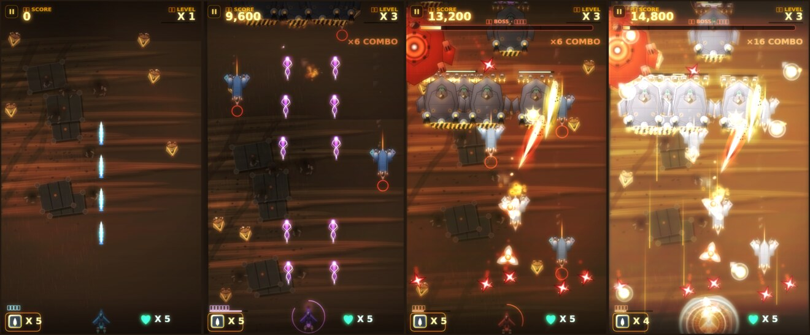

# 沙漠风暴 StormPlane · HTML5 强化美术版



Android 原版（`app/src/main/java/com/hurteng/stormplane/`）的 Web 重制：
**战斗数据全部沿用原版常量表，美术、特效、音效、UI、手感全部重写。**

- 零构建、零运行时依赖：原生 ES Module + Canvas 2D + WebAudio，任何静态服务器都能跑。
- 全部画面为程序化矢量绘制（启动时一次性烘焙成离屏贴图），任意分辨率/DPI 都清晰。
- 不加载任何图片与音频文件（唯一的外部资源是标题页背景 `assets/keyart.jpg`，可缺省）。

## 运行

```bash
cd web
node server.mjs 8123          # 内置零依赖静态服务器
# 或：python3 -m http.server 8123
# 或：npx serve .
```

浏览器打开 `http://localhost:8123/` 即可。手机可直接访问同一地址（竖屏体验最佳）。

## 目录

```
web/
├── index.html            界面骨架：标题 / 玩法 / 设置 / 暂停 / 结算
├── css/style.css         界面样式（画布只画游戏世界，菜单走 DOM）
├── server.mjs            零依赖静态服务器
├── src/
│   ├── config.js         ★ 原版 GameConstant / ConstantUtil / DebugConstant 的 1:1 移植
│   ├── util.js           数学 / 对象池 / 画布工厂 / 本地存储
│   ├── sprites.js        程序化美术：机体、弹幕、道具、护盾、爆炸贴图
│   ├── background.js     黄昏沙漠俯瞰战场（沙丘 / 要塞 / 坠机点 / 云影 / 闪电 / 风沙）
│   ├── fx.js             粒子系统 + 泛光后处理 + 屏震 / 顿帧 / 闪白
│   ├── audio.js          WebAudio 合成音效 + 随等级递进的自适应配乐
│   ├── entities.js       我方战机 / 三类敌机 / BOSS 四状态 / 全部弹种 / 道具
│   ├── game.js           主循环、出怪编排、碰撞、HUD（对应 MainView.java）
│   └── main.js           引导层：屏幕切换、输入、设置持久化、性能自适应
├── tools/                离线自检（开发用，见文末）
└── assets/keyart.jpg     标题页美术
```

## 一、保持不变的原始数据

`src/config.js` 是原版的逐条移植，未修改任何数值：

| 分组 | 常量 | 值 |
| --- | --- | --- |
| 初始 | `LIFEAMOUNT` / `MISSILECOUNT` | 5 / 5 |
| 上限 | `LIFE_MAXCOUNT` / `MISSILE_MAXCOUNT` | 9 / 9 |
| 节奏 | `GAMESPEED` / `MAXGRADE` / `LEVELUP_SCORE` | 1 / 6 / 50000 |
| 数量 | 小 / 中 / 大 / BOSS 机队规模 | 10 / 8 / 10 / 1 |
| 血量 | 小 / 中 / 大 / BOSS | 1 / 40 / 120 / 1000 |
| BOSS 阈值 | 愤怒 / 疯狂 / 极限 | 700 / 500 / 150 |
| 分数 | 小 / 中 / 大 / BOSS | 100 / 300 / 800 / 2000 |
| 出场门槛 | 中 / 大 / BOSS | 2000 / 8000 / 30000 |
| 道具门槛 | 紫弹夹 / 红弹夹 / 导弹 / 生命 | 3000 / 7000 / 5000 / 10000 |
| 伤害 | 导弹 / 蓝 / 紫 / 红 | 80 / 1 / 4 / 5 |
| 速度 | 蓝 / 紫 / 红弹，机体，大型机 | 80 / 100 / 120 / 30 / 3 |
| 时长 | 炸毁 / 无敌 / 导弹引爆 / 特殊弹夹 | 2000 / 5000 / 500 / 15000 ms |

同时保留的机制细节：

- **主循环时间基准**：原版每逻辑帧 100ms，本作的 `k = dt / 100`，所有 `speed`（像素/逻辑帧）与 `interval`（帧计数）按 `k` 缩放，因此 60fps 下的位移、摆幅、射速与原版等价。
- **出怪节奏**：`Game.initObject()` 完整照搬 `MainView.initObject()`——单逻辑帧只放出一架敌机，按「小型机 → 中型机 → 大型机 → BOSS」的列表顺序判定并 `break`；队距同样是 `y = -h * (currentCount * 2 + 1)`。
- **积分累加器**：`middlePlaneScore / bigPlaneScore / bossPlaneScore / missileScore / lifeScore / bulletScore / bulletScore2` 全部与 `sumScore` 同步增长，只有 BOSS 与道具在触发后清零，与原版的「出场后重新计数」一致。
- **武器弹夹**：蓝 4 发、紫 6 发（每发含左右两枚）、红 4 发；每逻辑帧装填 1 发；特殊弹夹 15 秒后自动回落为蓝色形态。
- **BOSS 编排**：四状态的进入条件、移动状态机（右下→左→右上→左 / 下潜到 2/3 屏高左右横扫 / 顶部横扫）、各状态下按 `speedTime` 组装的弹夹种类与数量、`interval >= 30 / speedTime + 5`（普通状态为 2）的发射门控，全部保留。
- **导弹**：对全屏可碰撞敌机造成 80 伤害，引爆期间（500ms）敌方停火、我方免疫碰撞。
- **生命**：初始 5，撞击或中弹扣 1，先 2s 炸毁动画再接 5s 无敌；归零后 1s 进入结算页。
- **道具行为**：从屏幕中央生成后以 `10 + rand(5)` 的速度在四个方向间反弹游走，被拾取前不会被新的同类道具替换（原版的「抢不到就一直占位」规则）。

## 二、加强（不改动上述数值）

**美术**

- 机体：装甲渐变 + 蒙皮刻线 + 铆钉 + 座舱玻璃反光 + 危险条纹 + 运行时双层锥焰；三形态我方战机、三类敌机、BOSS 四状态（含极限状态的闪烁帧）全部重绘。
- 弹幕：10 种弹体（我方 3 种、大型机烈焰飘雪、BOSS 火焰弹 / 闪光粒子球 / 悬浮三角 / 双生闪电球 / 双色地狱火）各自带辉光、拖尾与旋转。
- 战场：可无缝纵向滚动的俯瞰沙漠——沙丘脊线、风成波纹、干涸河床、岩石残骸、要塞地基与坠机点，分 3 层视差；云影、闪电、暖色地平光、风沙层与暗角。
- 表现层：`ctx.filter` 亮部提取 + 模糊 + 加色回叠的 Bloom；受击泛白、残骸下坠、连续爆点、冲击环、飘字、屏震、顿帧、死亡径向拉伸；粒子走对象池，画质可分三档。

**音效与音乐**：WebAudio 实时合成（压缩器 + 卷积混响 + 噪声/振荡器），10 余种音效；配乐按等级逐层叠加（底鼓 → 琶音 → 踩镲 → 铺底 → 高音层），BOSS 在场时提升音量总线。原版 `res/raw` 音频仍保留在 Android 工程中，二者互不影响。

**手感与可访问性**：鼠标跟随 / 触屏相对拖拽 / 键盘三种操控；受击判定盒与机体速度可调；小地图式的实时侧栏数据；掉帧自动降画质；设置与最高分持久化；`prefers-reduced-motion` 适配。

**模式**：`经典` = 完全原版；`风暴` = 出怪队列 ×1.5、大型机带护卫、BOSS 弹夹 +2、道具吸附、判定 75%、机动 ×1.6（**血量 / 伤害 / 分数 / 阈值仍取原版常量**）。

## 三、对原版代码的修正

移植过程中发现的确定性 Bug 已修正，均在本文件与 `entities.js` 注释中以 `[修正]` 标注：

1. `BossDefaultBullet.initial()` 写成 `object_y = arg1 + 2 * object_height`（`arg1` 是 x 坐标），`BossTriangleBullet` / `BossRHellfireBullet` / `BossYHellfireBullet` 同样如此 → 改为按弹口坐标生成。
2. BOSS 普通状态的火焰弹沿 Y 轴向屏幕外飞行，玩家几乎不可能被命中 → 改为朝我方战机方向喷射的双生火焰阵（弹速与摆幅保持原值），对应 README 描述的「连续喷射的火焰阵」。
3. `MyPurpleBullet.isCollide()` 在左右两发同时命中时把 `harm` 从 4 降为 2（越准越弱）→ 改为双发叠加伤害。
4. 子弹碰撞用逐帧矩形检测，80～120 像素/帧的高速弹会穿透薄目标 → 改为扫掠 AABB。
5. 地狱火按 README 的「由沙漠中冒出，不断向上蔓延」实现：疯狂/极限状态下从屏幕底缘沙地喷发并带沙暴预警环。
6. 原版用 `new Thread(...)` + `SystemClock.sleep` 实现受伤 / 无敌计时（与渲染线程竞态）→ 改为时间戳驱动。
7. 各 `*Plane` 用 `static currentCount` 记录出生队距（重开一局不会归零）→ 改为对局内的 `takeSpawnSlot()`，重开即重置。
8. 小型机的 `object_x += 20 * speedTime * sin(object_y)` 在 100ms/帧下是逐帧乱抖 → 保留幅值与频率语义，改为可辨识的正弦飘动（高帧率下不再抖动抽搐）。

## 四、开发自检（可选，需要 Node）

```bash
cd web && npm i -D @napi-rs/canvas   # 仅开发依赖，不进入游戏包体
node --version                        # 需要 Node 18+
node tools/render-check.mjs  # 烘焙全部精灵并输出总览图
node tools/sim-check.mjs     # 离线跑对局：出怪 / 三形态 / BOSS 四状态 / 导弹 / 坠机
node tools/dom-check.mjs     # DOM 垫片驱动的冒烟测试：启动→操控→设置→结算→重开
```

三个脚本都只依赖开发用的 `@napi-rs/canvas`，缺依赖时会打印安装提示后退出。默认输出到 `web/preview/`（已在 `.gitignore` 中），也可传参指定别的目录——用于在没有浏览器的环境里核对美术与逻辑。

## 许可

Apache-2.0，与仓库根目录一致。原始素材与代码版权归 HurTeng / StormPlane 项目。
